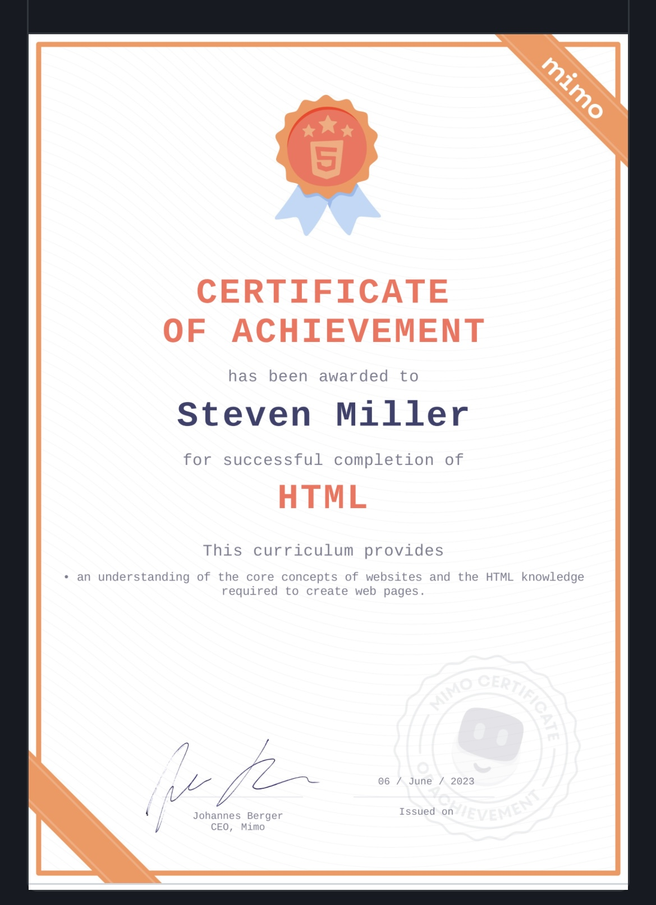

<h1> Hi, I’m @sem2093 or Steve</h1> 
<code></code>

 I’m interested in development.
 I’m currently learning JavaScript, Python, React, C#, C++ and SQL.
 
 
 
 
 
 
<h2>What I practice </h2>

<code></code>

<code></code>

<code></code>

<code></code>

<code></code>

<code></code>

  

<h2>Tools</h2>

<code></code>

<code></code>

<code></code>

<code>
 
</code>

 

  
 

  

   

  

 

<!---
sem2093/sem2093 is a ✨ special ✨ repository because its `README.md` (this file) appears on your GitHub profile.
You can click the Preview link to take a look at your changes.
--->
